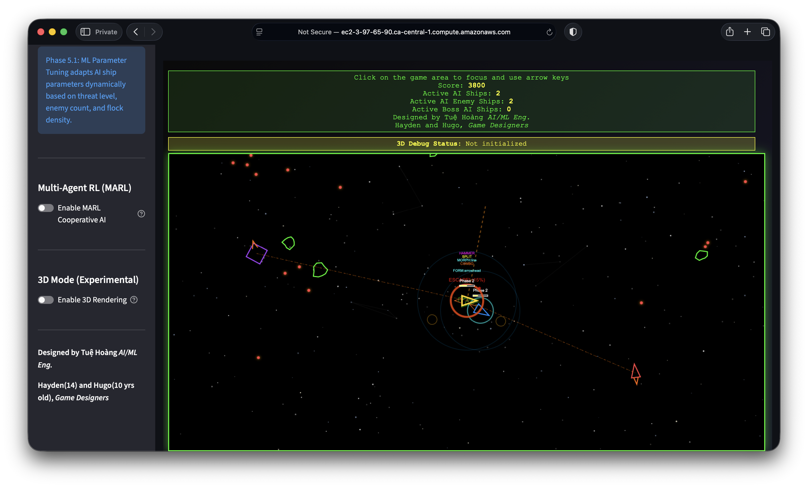

# ML Driven Asteroid Ships

A classic Asteroids arcade game with **Agentic ML**–driven AI ships. Implemented in three ways: **Streamlit** (web, embeds HTML5/JS game), **standalone HTML5** (browser), and **Pygame** (desktop).

## Objective

This game demonstrates **Agentic ML in Action** through intelligent AI-controlled asteroid ships. Watch as multiple AI ships coordinate attacks, form tactical formations, and adapt their strategies in real-time.

## How to Run

| Version | Command | Notes |
|--------|--------|--------|
| **Streamlit (web)** | `./run_streamlit.sh` | Opens in browser at http://localhost:8501 |
| **Pygame (desktop)** | `./run.sh` | Native window; run from project root |
| **Online** | [Play on AWS](http://ec2-3-97-65-90.ca-central-1.compute.amazonaws.com:8501) | Deployed Streamlit instance |

From project root, ensure scripts are executable (`chmod +x run_streamlit.sh run.sh` if needed). Streamlit uses the same `asteroids3/.venv` and installs Streamlit on first run if missing.

### Pushing to GitHub (neuro-asteroids-ml-ships)

To push code to the NeuroGamingLab repo, store your GitHub token in a **gitignored** file so it is never committed:

1. **Recommended:** In the project root, create a file named **`.env`** (or copy from `.env.example`):
   ```bash
   cp .env.example .env
   ```
   Edit `.env` and set:
   ```bash
   GITHUB_TOKEN=ghp_your_actual_token_here
   ```
   `.env` is already in `.gitignore`; it will not be committed.

2. **Alternative:** Create a file named **`.github_token`** in the project root and put only the token in it (one line). `.github_token` is also gitignored.

Then push as usual (e.g. `git push origin main`). If you use HTTPS and the remote asks for a password, use the token as the password, or set the remote to `https://YOUR_TOKEN@github.com/NeuroGamingLab/neuro-asteroids-ml-ships.git` (avoid committing this URL).

**Never commit the token or any file containing it.**

### GitHub Pages

A project landing page (similar to [Neuro Gaming Lab](https://neurogaminglab.github.io/Neuro-Gaming-Lab/)) is in the `docs/` folder. To publish it:

1. Push the repo (including the `docs/` folder) to GitHub.
2. In the repo: **Settings → Pages**.
3. Under **Build and deployment**, set **Source** to **Deploy from a branch**.
4. Choose branch (e.g. `main`) and folder **`/docs`**, then Save.

The site will be available at `https://<org>.github.io/<repo-name>/` (e.g. `https://neurogaminglab.github.io/neuro-asteroids-ml-ships/`).

## How to Observe Agentic ML Ships in Action

1. **Launch the game** using the commands above or the deployed link
2. **Enable AI ships** in the game settings to activate the agentic ML system
3. **Watch the AI ships** coordinate attacks, form tactical formations, and adapt their strategies
4. **Observe enemy AI ships** as they execute coordinated alpha attacks and advanced tactical sequences
5. **Monitor the real-time behavior** as the ML agents learn and adapt during gameplay

**🌐 Play the game online:** [http://ec2-3-97-65-90.ca-central-1.compute.amazonaws.com:8501](http://ec2-3-97-65-90.ca-central-1.compute.amazonaws.com:8501)

The game is terraformed on AWS and ready to play. Access the live version to observe the Agentic ML ships in action!





## Features

-  Triangular ship with rotation and momentum-based movement
-  Triple-barrel gun system (fires 3 bullets simultaneously)
-  5 asteroids with random movement patterns
-  Shooting mechanics with bullet physics
-  Shield force field (repels asteroids when active, size-based physics)
-  **Enhanced AI-controlled ships** with:
  - Autonomous navigation and asteroid avoidance
  - Health system (3 health points)
  - Shield system (cyan pulsing shield)
  - Phase system (3 phases with indicators)
  - Combat engagement with enemy ships
  - Multi-agent coordination and flocking
  - Defensive flocking when enemies present
  - **ML Integration (Phase 5.1, 5.2, 5.3)**:
    - Phase 5.1: ML Parameter Tuning (adaptive parameter optimization)
    - Phase 5.2: ML Priority Weights (adaptive decision priorities)
    - Phase 5.3: Full ML Decision Making (direct action prediction with safety validation)
  - **Alpha Attack Pattern System**:
    - Phase 1: Dynamic Formations (5 types: Arrowhead, Line, Circle, Diamond, Wedge)
    - Phase 2: Role Specialization, Formation Abilities, Flanking Maneuvers
    - Phase 3: Adaptive Formations, Multi-Target Coordination, Escort & Protection Modes
-  **Enemy Ship System** with three types:
  - Basic Enemy Ships (red, 1 health)
  - Advanced Enemy Ships (purple, 2 health, tactical AI)
  - **Boss Enemy Ships** (large red, 5 health, complex attack patterns, phases, special abilities)
-  Collision detection system
-  Hyperspace feature (teleportation with risk)
-  Score tracking with real-time ship counts
-  Retro green-on-black visual theme


## Controls

*(Below: Streamlit / HTML5 version. For Pygame desktop controls see [asteroids3/README_PYGAME.md](asteroids3/README_PYGAME.md).)*

- **Arrow Keys**: 
  - ↑ Forward thrust
  - ↓ Backward movement
  - ← Rotate left / Strafe left
  - → Rotate right / Strafe right
- **Space Bar**: Fire bullets / Speed boost
- **F**: Shield Force (hold to activate - repels asteroids)
- **H**: Hyperspace (teleport to random location)
- **ESC**: Toggle fullscreen mode

## Game Mechanics

- **Momentum Physics**: Ship continues moving after thrust until friction slows it down
- **Screen Wrapping**: All objects wrap around screen edges
- **Asteroid Spawning**: New asteroids spawn when destroyed to maintain 5 asteroids
- **Shield Force Field**: Hold F key to activate shield that repels asteroids
  - Size-based physics: Large asteroids push the ship away, small asteroids bounce off
- **AI Ships**: Enhanced AI-controlled ships (blue) with advanced capabilities
  - **Health System**: 3 health points per ship
  - **Shield System**: Cyan pulsing shield blocks enemy bullets and asteroids
  - **Phase System**: 3 phases (Green → Yellow → Red) based on health
  - **Combat**: Fires at enemy ships and asteroids
  - **Coordination**: Multi-agent coordination and flocking behavior
  - **Defensive Flocking**: Moves closer together when enemies present
  - **Visual Indicators**: Health bar, phase indicator, shield effect
  - Detects asteroids within 100px detection radius
  - Automatically navigates, avoids collisions, and engages enemies
  - Destroyed when health reaches 0 (permanently removed)
- **Enemy Ships**: Hostile AI ships that attack player and AI ships
  - **Basic**: Red triangular ships (1 health, moderate fire rate)
  - **Advanced**: Purple diamond ships (2 health, tactical AI, evasive maneuvers)
  - **Boss**: Large red hexagonal ships (5 health, complex patterns, phases, special abilities)
- **Boss Ship Features**:
  - Complex attack patterns: Spread shot, rapid fire, circular pattern, normal
  - Three-phase system based on health (100-60%, 60-30%, 30-0%)
  - Shield system: Yellow pulsing shield blocks damage
  - Teleportation: Phase 3 ability to teleport when health ≤ 1
  - Erratic movement: Unpredictable patterns in Phase 3
  - Health bar with phase indicator
- **Collision Detection**: Circular collision detection for ship, bullets, and asteroids
- **Score System**: 100 points per asteroid destroyed


---

**Designed by Tuệ Hoàng, *AI/ML Eng.***  
**Hayden (14) and Hugo (10) — *Gaming Specialists***  
*With assistance from multi-LLM.*

**Repository**: [neuro-asteroids-ml-ships](https://github.com/NeuroGamingLab/neuro-asteroids-ml-ships)  
**Project started**: 24 Dec 2025  
**Last updated**: 7 Feb 2026